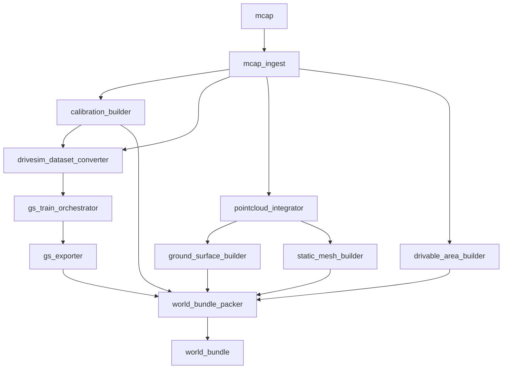

# gs_world_builder 内部コンポーネント設計

**バージョン**: 1.0.1
**最終更新**: 2026-02-15

## 概要

このドキュメントは `gs_world_builder` の**内部コンポーネント分割と実装設計**を定義します。

**重要な区別**:
- **[docs/interfaces/offline_builder.md](../../docs/interfaces/offline_builder.md)** - 外部インターフェース契約（入出力、CLI、設定ファイル）
- **このドキュメント** - 内部実装の設計指針（コンポーネント分割、データフロー）

---

## 設計原則

1. **パイプライン型アーキテクチャ**: 各コンポーネントが順次実行される
2. **独立性**: 各コンポーネントは独立してテスト・デバッグ可能
3. **中間生成物の保存**: 各ステップの出力を保存し、再実行可能に
4. **段階的実装**: 任意コンポーネントをスキップして最小構成で動作可能

---

## 全体フロー

```
mcap
  ↓
1-1. mcap_ingest ──────────────────┐
  ↓                                │
1-2. calibration_builder           │
  ↓                                │
1-3. drivesim_dataset_converter    │
  ↓                                │
1-4. gs_train_orchestrator         │
  ↓                                │
1-5. gs_exporter                   │
  ↓                                │
1-6. geometry_builder ←────────────┘
  ├─ 1-6a. pointcloud_integrator
  ├─ 1-6b. ground_surface_builder
  ├─ 1-6c. drivable_area_builder
  └─ 1-6d. static_mesh_builder (optional)
  ↓
1-7. world_bundle_packer
  ↓
world_bundle
```

---

## コンポーネント詳細

### 1-1. mcap_ingest（MCAP取り込み・正規化）

**責務**: MCAP からセンサデータを抽出し、後続処理用に正規化

**入力**:
- `*.mcap` - ROS2 MCAP ファイル

**出力**:
```
workspace/00_mcap_ingest/
├── raw_extract/
│   ├── images/
│   │   ├── camera_front/
│   │   │   ├── 0000000000.jpg
│   │   │   ├── 0000000001.jpg
│   │   │   └── ...
│   │   ├── camera_left/
│   │   └── camera_right/
│   ├── lidar/
│   │   ├── 0000000000.pcd  (or .npz)
│   │   ├── 0000000001.pcd
│   │   └── ...
│   ├── poses.csv
│   └── tf/
│       ├── tf.json
│       └── tf_static.json
├── timeline.json
├── frameset.json
└── timebase.yaml
```

**処理内容**:
1. MCAP を開き、必要な topic を特定（設定ファイルのマッピング使用）
2. カメラ画像をデコード・保存（JPEG/PNG、必要なら）
3. LiDAR点群を抽出・保存（PCD または npz 形式）
4. Ego軌跡を抽出（`/odom` または `/localization/pose`）
5. TF 情報を JSON 形式で保存
6. 全センサのタイムスタンプを `timeline.json` に記録
7. シミュレータ用リサンプリング対応表を `frameset.json` に生成
8. センサレートから `timebase.yaml` の初期値を生成

**実装ノート**:
- カメラ画像のデコードは CPU 負荷が高いため、必要な場合のみ実行
- LiDAR は PCD 形式推奨（Open3D で読み込みやすい）
- `poses.csv` のフォーマット: `timestamp,x,y,z,qx,qy,qz,qw`

---

### 1-2. calibration_builder（キャリブ/座標系の確定）

**責務**: センサキャリブレーションの確定と座標系情報の記録

**入力**:
- `workspace/00_mcap_ingest/raw_extract/tf/`
- MCAP 内の `/camera/*/camera_info`
- `config.yaml`（センサ仕様、リサイズ設定等）

**出力**:
```
workspace/01_calibration/
├── calibration.yaml
├── tf_static.json
└── metadata.json (部分)
```

**処理内容**:
1. camera_info から intrinsics を抽出
2. リサイズ・undistort がある場合、intrinsics を再計算
3. TF から extrinsics を抽出（base_link → 各センサ）
4. `calibration.yaml` を生成（[world_bundle_schema.md](../../docs/interfaces/world_bundle_schema.md) 準拠）
5. `calibration.yaml` から `tf_static.json` を派生生成
6. 座標系情報（ENU/FLU、原点）を `metadata.json` に記録

**実装ノート**:
- **calibration.yaml が正**: tf_static.json は派生物
- 不一致があってはならない（validation で検出）
- camera_convention (opencv/ros) を明示

---

### 1-3. drivesim_dataset_converter（DriveStudio入力生成）

**責務**: DriveStudio が読み込める形式にデータを変換

**入力**:
- `workspace/00_mcap_ingest/raw_extract/`
- `workspace/01_calibration/calibration.yaml`
- `workspace/00_mcap_ingest/frameset.json`

**出力**:
```
workspace/02_drivesim_dataset/
├── images/
│   ├── camera_front/
│   ├── camera_left/
│   └── camera_right/
├── poses/
│   ├── camera_front.txt
│   ├── camera_left.txt
│   └── camera_right.txt
├── intrinsics.json
└── dataset_config.json
```

**処理内容**:
1. DriveStudio のデータセット形式に合わせて画像を配置
2. カメラ pose を DriveStudio 形式（4x4 行列等）に変換
3. intrinsics を DriveStudio 形式に変換
4. keyframe/補間の扱いを決定（12Hz カメラの場合）
5. 露出揺れがある場合のメタ情報を保持（任意）

**実装ノート**:
- DriveStudio の具体的なフォーマットに依存
- DriveStudio のバージョンに注意（commit hash を記録）

---

### 1-4. gs_train_orchestrator（3DGS学習実行・管理）

**責務**: 3DGS 学習を再現可能に実行・管理

**入力**:
- `workspace/02_drivesim_dataset/`
- `gs_training_config.yaml`（学習設定）

**出力**:
```
workspace/03_gs_training/
├── checkpoints/
│   ├── iteration_7000/
│   ├── iteration_15000/
│   └── iteration_30000/
├── training_log.txt
├── metrics.json
└── training_report.json
```

**処理内容**:
1. DriveStudio の学習スクリプトを起動
2. 設定を固定（config の凍結、seed、commit hash 記録）
3. "背景のみ" モードで学習
4. 学習ログを記録
5. 収束指標（PSNR等）を `metrics.json` に記録
6. 最良 iteration を特定し、`training_report.json` に記録

**実装ノート**:
- **再現性が最重要**: seed、config、commit hash を記録
- GPU メモリ不足時のエラーハンドリング
- 長時間実行のため、進捗表示・中断再開を考慮

---

### 1-5. gs_exporter（ランタイム用Gaussianフォーマットへ変換）

**責務**: DriveStudio の内部フォーマットをランタイム用に変換

**入力**:
- `workspace/03_gs_training/checkpoints/iteration_30000/`
- `workspace/03_gs_training/training_report.json`（最良 iteration）

**出力**:
```
workspace/04_gs_export/
├── background.splat.ply
└── render_config.json
```

**処理内容**:
1. 最良 iteration の checkpoint を読み込み
2. Gaussian パラメータを抽出
3. PLY 形式（`format binary_little_endian 1.0`）でエクスポート
   - 必須属性: x, y, z, scale_0-2, rot_0-3, opacity, f_dc_0-2, f_rest_*
4. 色補正・露出係数を `render_config.json` に記録

**実装ノート**:
- **ランタイムが DriveStudio に依存しない**ための最重要コンポーネント
- PLY ヘッダのフォーマットを厳密に ([world_bundle_schema.md](../../docs/interfaces/world_bundle_schema.md) 参照)
- 代替として .npz 形式も許容

---

### 1-6. geometry_builder（走行用幾何を作る）

**責務**: シミュレータの走行・LiDAR 生成に必要な幾何を生成

4つのサブコンポーネントから構成：

---

#### 1-6a. pointcloud_integrator（点群統合）

**責務**: フレーム単位の LiDAR 点群を統合して静的点群地図を生成

**入力**:
- `workspace/00_mcap_ingest/raw_extract/lidar/` - フレーム単位の点群
- `workspace/00_mcap_ingest/raw_extract/poses.csv` - Ego軌跡

**出力**:
```
workspace/05_geometry/
└── point_cloud_map.pcd
```

**処理内容**:
1. 各フレームの LiDAR 点群を読み込み
2. Ego軌跡を使って map frame に変換
3. すべての点群を統合
4. 動的物体のフィルタリング（オプション）
   - 簡易的には voxel grid filter で密度の低い点を除去
5. PCD 形式で保存

**実装ノート**:
- Open3D 推奨（統合、フィルタリング機能が豊富）
- メモリ使用量に注意（大規模シーンの場合）
- 動的物体フィルタリングは初期実装では省略可

---

#### 1-6b. ground_surface_builder（地面モデル）

**責務**: 統合点群から 2.5D heightmap を生成

**入力**:
- `workspace/05_geometry/point_cloud_map.pcd`
- `workspace/00_mcap_ingest/raw_extract/poses.csv`（範囲決定用）
- `geometry_config.yaml`（解像度、範囲）

**出力**:
```
workspace/05_geometry/
├── heightmap.bin
└── heightmap.yaml
```

**処理内容**:
1. 点群を X-Y 平面にグリッド分割（解像度: 0.1m 推奨）
2. 各グリッドセルで Z 座標の代表値を計算（中央値推奨）
3. メディアンフィルタで平滑化
4. 外れ値除去（統計的手法）
5. Little Endian float32 配列として `heightmap.bin` に保存
6. メタ情報を `heightmap.yaml` に保存

**実装ノート**:
- 無効領域（地面がない）は NaN で表現
- row-major レイアウト (Y x X)
- 範囲は Ego 軌跡 ± バッファで決定

---

#### 1-6c. drivable_area_builder（走行可能領域）

**責務**: Ego軌跡から走行可能領域を生成

**入力**:
- `workspace/00_mcap_ingest/raw_extract/poses.csv`
- `geometry_config.yaml`（バッファ幅）
- （任意）HDMap（Lanelet2 等）

**出力**:
```
workspace/05_geometry/
└── drivable.geojson
```

**処理内容**:
1. Ego軌跡を読み込み
2. 軌跡の左右に buffer_width（例: 10m）のバッファを設定
3. Polygon を生成（Shapely 推奨）
4. ポリゴン簡略化（Douglas-Peucker アルゴリズム）
5. GeoJSON 形式で保存（[world_bundle_schema.md](../../docs/interfaces/world_bundle_schema.md) 準拠）

**実装ノート**:
- 初期実装は軌跡バッファのみで十分
- HDMap 統合は将来拡張
- 複数ポリゴンの priority 対応

---

#### 1-6d. static_mesh_builder（任意：精密メッシュ）

**責務**: 統合点群から精密な 3D メッシュを生成

**入力**:
- `workspace/05_geometry/point_cloud_map.pcd`
- `geometry_config.yaml`（voxel_size、method）

**出力**:
```
workspace/05_geometry/
└── static_mesh.glb
```

**処理内容**:
1. 点群から 3D メッシュを再構成
   - Poisson Reconstruction（滑らか）
   - または TSDF（精密）
2. メッシュを簡略化（三角形数削減）
3. glTF 2.0 Binary (.glb) 形式で保存

**実装ノート**:
- **初期実装では省略推奨**（heightmap で代用可能）
- 計算コストが高い
- 高精度 LiDAR raycast が必要になったら実装

---

### 1-7. world_bundle_packer（world_bundle生成）

**責務**: すべての中間生成物を world_bundle 構造に集約・検証

**入力**:
- `workspace/04_gs_export/background.splat.ply`
- `workspace/04_gs_export/render_config.json`
- `workspace/05_geometry/heightmap.*`
- `workspace/05_geometry/drivable.geojson`
- `workspace/05_geometry/static_mesh.glb`（任意）
- `workspace/01_calibration/calibration.yaml`
- `workspace/01_calibration/tf_static.json`
- `workspace/00_mcap_ingest/timebase.yaml`
- `workspace/01_calibration/metadata.json`（部分）

**出力**:
```
worlds/<scene_id>/
├── world.yaml
├── metadata.json (完全版)
├── gaussians/
│   ├── background.splat.ply
│   └── render_config.json
├── geometry/
│   ├── heightmap.bin
│   ├── heightmap.yaml
│   ├── drivable.geojson
│   └── static_mesh.glb (optional)
├── sensors/
│   ├── calibration.yaml
│   └── tf_static.json
└── sim/
    └── timebase.yaml

build_report.json
```

**処理内容**:
1. world_bundle ディレクトリ構造を作成
2. 各ファイルを適切な場所にコピー
3. `world.yaml` を生成（各ファイルへの相対パスを集約）
4. `metadata.json` を最終化
   - 各ステップの部分情報を統合
   - 処理時間、統計情報を追記
   - 生成元 mcap の MD5 ハッシュを記録
5. **最終検証**
   - schema 準拠チェック（[world_bundle_schema.md](../../docs/interfaces/world_bundle_schema.md)）
   - 必須ファイルの存在確認
   - calibration.yaml と tf_static.json の一貫性チェック
   - バイナリファイルの読み込み可能性チェック
6. `build_report.json` を生成
   - 各ステップの処理時間
   - 統計情報（Gaussian数、heightmap解像度等）
   - 警告・エラーメッセージ

**実装ノート**:
- validation 失敗時はエラーで終了（world_bundle 生成しない）
- build_report.json は再ビルド時のトレーサビリティのため重要

---

## ワークスペース構造

```
.gs_world_builder_workspace/<scene_id>/
├── 00_mcap_ingest/
│   ├── raw_extract/
│   ├── timeline.json
│   ├── frameset.json
│   └── timebase.yaml
├── 01_calibration/
│   ├── calibration.yaml
│   ├── tf_static.json
│   └── metadata.json
├── 02_drivesim_dataset/
│   ├── images/
│   ├── poses/
│   └── dataset_config.json
├── 03_gs_training/
│   ├── checkpoints/
│   ├── training_log.txt
│   ├── metrics.json
│   └── training_report.json
├── 04_gs_export/
│   ├── background.splat.ply
│   └── render_config.json
├── 05_geometry/
│   ├── point_cloud_map.pcd
│   ├── heightmap.bin
│   ├── heightmap.yaml
│   ├── drivable.geojson
│   └── static_mesh.glb (optional)
└── 06_world_bundle/
    └── (最終 world_bundle のコピー)

build_report.json
```

---

## 実装優先順位

### Phase 1: 最小構成（必須）

実装順序:
1. ✅ mcap_ingest
2. ✅ calibration_builder
3. ✅ drivesim_dataset_converter
4. ✅ gs_train_orchestrator
5. ✅ gs_exporter
6. ✅ pointcloud_integrator
7. ✅ ground_surface_builder
8. ✅ drivable_area_builder（軌跡バッファのみ）
9. ✅ world_bundle_packer

**目標**: Closed-loop シミュレータが動作する最小 world_bundle を生成

---

### Phase 2: 精度向上（任意）

10. static_mesh_builder（高精度 LiDAR 用）
11. HDMap 統合（drivable_area_builder 拡張）
12. 動的物体フィルタリング（pointcloud_integrator 拡張）

---

## コンポーネント間のデータフロー



---

## テスト戦略

### 単体テスト

各コンポーネントを独立してテスト:

```bash
# 例: mcap_ingest のみテスト
pytest tests/test_mcap_ingest.py
```

**テスト内容**:
- 入力の妥当性チェック
- 出力ファイルの存在確認
- フォーマットの正しさ

---

### 統合テスト

minimal MCAP でパイプライン全体をテスト:

```bash
# 最小 MCAP（10秒程度）で全パイプライン実行
gs-world-builder build --input tests/data/minimal.mcap --output /tmp/test_world
```

**検証項目**:
- すべてのステップが正常終了
- world_bundle が schema に準拠
- validation が通過

---

## エラーハンドリング

### 各コンポーネントの責務

- **入力検証**: 入力ファイル・パラメータの妥当性チェック
- **エラー報告**: 明確なエラーメッセージ（どこで、何が、なぜ失敗したか）
- **中間生成物の保存**: 失敗時も中間ファイルを残す（デバッグ用）

### エラー種別

| 種別 | 終了コード | 対処 |
|------|----------|------|
| 設定エラー | 2 | config.yaml を修正 |
| 入力 MCAP エラー | 3 | MCAP ファイルを確認 |
| トピック不足エラー | 4 | トピックマッピングを確認 |
| 処理失敗 | 5 | ログを確認、中間生成物を調査 |
| 検証失敗 | 6 | world_bundle を修正 |

---

## パフォーマンス最適化

### ボトルネック

1. **gs_train_orchestrator**: 全体の 90%（GPU 必須）
2. **pointcloud_integrator**: 大規模シーンで重い
3. **mcap_ingest**: カメラ画像デコード

### 最適化戦略

- 並列処理（複数カメラの画像デコード）
- GPU 利用（3DGS 学習）
- メモリ効率化（点群のストリーミング処理）

---

## 変更履歴

| バージョン | 日付 | 変更内容 |
|-----------|------|---------|
| 1.0.1 | 2026-02-15 | 誤ったリファレンス修正、終了コード4追加 |
| 1.0.0 | 2026-02-14 | 初版作成 |
